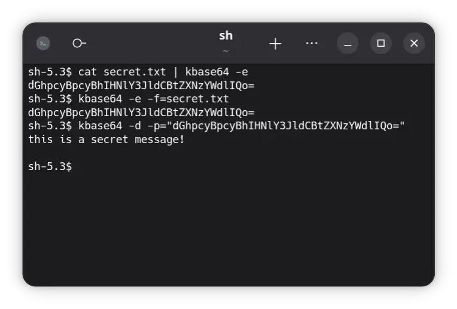

# base64

Base64 encoder/decoder.

## Usage

**Encoding** `-e` or **decoding** `-d` must be specified.

By default the program will read from stdin, to read from a **file** provide the `-f` flag, or pass
the **payload** directly in with the `-p` flag.



## Help

```
base64 - Base64 encoder/decoder.

Options:
  --help, -h
    Displays this help text.

  --version, -v
    Displays version of program.

  --payload, -p, --text, -t = <text: string>
    Payload/Text to encode/decode, instead of file.

  --file, -f = <file-name: string>
    Encode/Decode file contents.

  --encode, -e
    Encode plain text to base64.

  --decode, -d
    Decode base64 to plain text.
```
