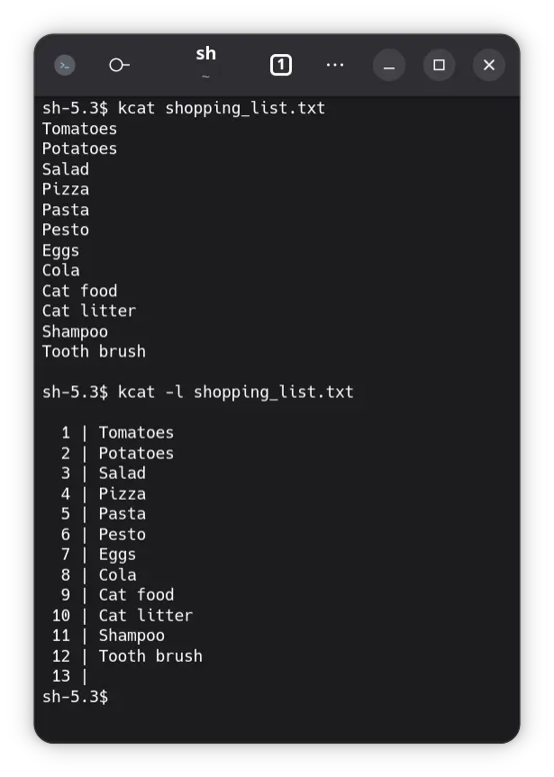
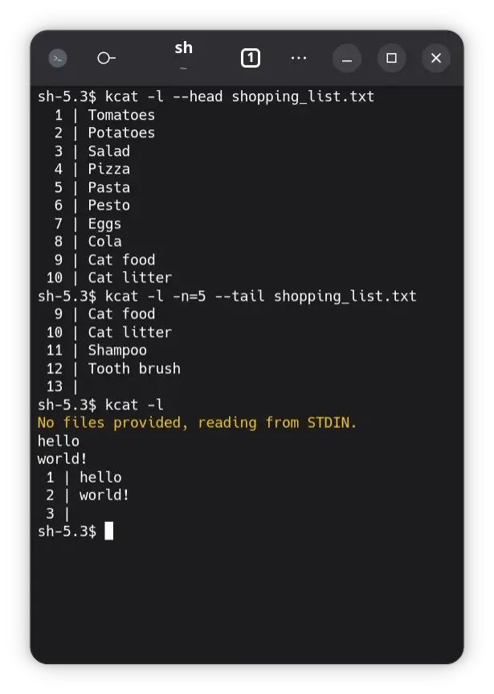

# cat

Concatenate files and print to stdout.

## Usage

To print **line numbers** use the `-l` flag. Printing the **tail** `-T` und **head** `-H` of the
file is also supported, specify the **number of lines** with `-n` (default: 10).

|  |  |
|-------------------------------|--------------------------------|

## Help

```
cat - Concatenate files and print to stdout.

Options:
  --help, -h
    Displays this help text.

  --version, -v
    Displays version of program.

  --line-numbers, -l
    Add line numbers infront of each line.

  --head, -H
    Only print the first X lines.

  --tail, -T
    Only print the last X lines.

  --numbers, -n = <number: int> | 10
    Specifies how many first or last lines are printed with head/tail.
```
