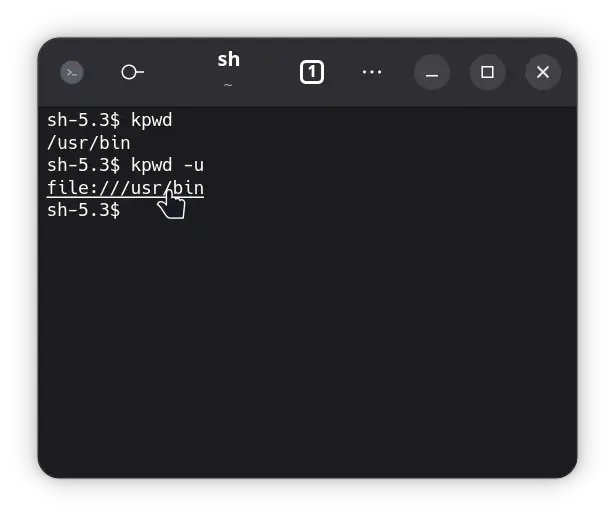

# echo

Writes to stdout.

## Usage

This program provides basic flags for **removing trailing new line** `-n`, enabling **character escape
sequences** `-e` and **indenting** the entire output `-i`.



## Help

```
echo - Writes to stdout.

Options:
  --help, -h
    Displays this help text.

  --version, -v
    Displays version of program.

  --no-new-line, -n
    Removes trailing new line character.

  --escape, -e
    Escapes escape sequences.

  --indent, -i = <number: int> | 4
    Indents output by a number of spaces.
```
