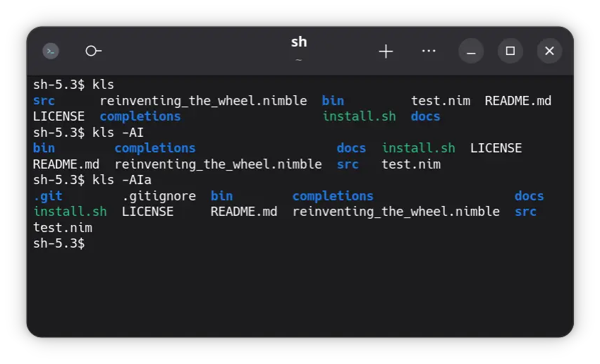
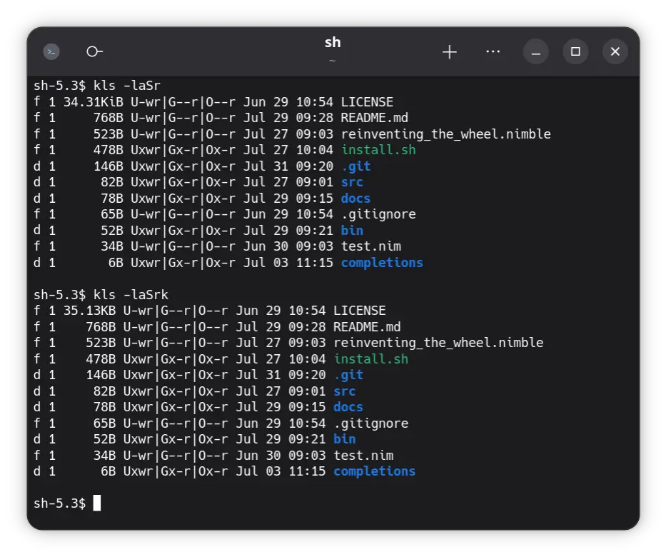
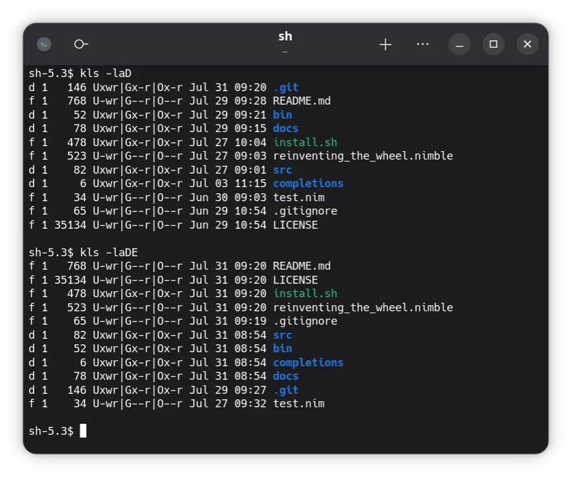

# ls

List files and directories.

## Usage

By default the program will try to fit the terminal width with a fitting amount of columns, with a
maximum of 16.
If you want to force a specific amount of columns use the `-c` flag: `ls -c=4`.

| Sorting      | Image                               |
|--------------|-------------------------------------|
| Alphabetical |  |
| Size         |          |
| Date         |          |

Output can be sorted **alphabetically** `-A`, by **size** `-S` or **date** `-D`.

For **alphabetical** sorting you can use the `-I` flag for case-insensitive sorting.

**Sizes** can use either 1024 (KiB, default) or 1000 (KB, `-k`) Bytes per K. Both must be enabled
with the human-readable flag `-r`.

By default the **date** is the last-write time, however this can be changed to the creation
time `-C`, or last access time `-E`.

## Help

```
ls - List files and directories.

Options:
  --help, -h
    Displays this help text.

  --version, -v
    Displays version of program.

  --all, -a
    List hidden files/dotfiles.

  --long, -l
    Long listing.

  --file-urls, -u
    Prints clickable file urls.

  --full-path, -f
    Prints absolute file path.

  --columns, -c = <number: int> | 0
    Specify amount of columns.

  --shorting, -s = <number: int> | 0
    Shorten file/directory names when exceeding specified length. Exceeded length will have '...' appended.

  --time-creation, -C
    Display creation time instead of last write time in long listing.

  --time-last-access, -E
    Display time of last access instead of last write time in long listing.

  --human-readable, -r
    Display file sizes in human readable format.

  --use-1000, -k
    Human readable format in 1000s steps (eg. kilobyte) instead of 1024s (eg. kibibyte).

  --alphabetical, -A
    Sort output alphabetically.

  --ignore-case, -I
    Ignore case for alphabetical sort.

  --size, -S
    Sort output by size.

  --date, -D
    Sort output by date.

  --reverse, -R
    Reverse sorting.
```
