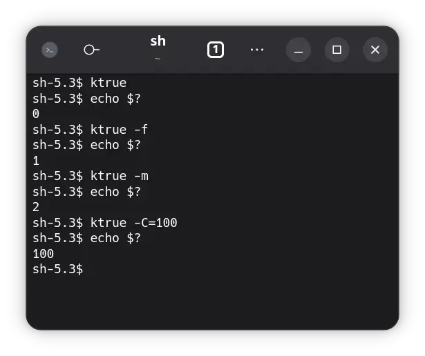

# true

Exits with exit-code 0 or a custom one.

## Usage

By default exits with code `0`, can be a **custom** one with `-C`: `true -C=100`.
Some named exit codes according to the
[Advanced Bash-Scripting Guide](https://tldp.org/LDP/abs/html/exitcodes.html#EXITCODESREF)
are available as well.



## Help

```
true - Exits with exit-code 0 or a custom one.

Options:
  --help, -h
    Displays this help text.

  --version, -v
    Displays version of program.

  --code, -C = <number: int>
    Use this exit code [0..127].

  --false, --failure, -f
    General failure (1).

  --misuse, -m
    Misuse of command (2).

  --no-permission, -p
    No permission (126).

  --not-found, -n
    Not found (127).
```
